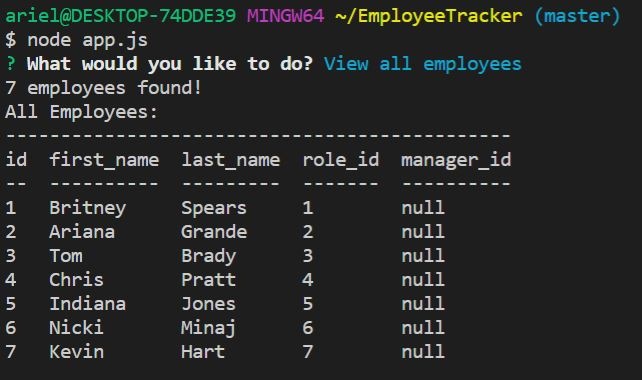

Employee Tracker

A solution for managing a company's employees using node, inquirer, and MySQL
* The command-line application allows users to:

  * Add departments, roles, employees
  * View departments, roles, employees
  * Update employee roles
  * View employees by manager
  * Delete departments, roles, employees

Visual

